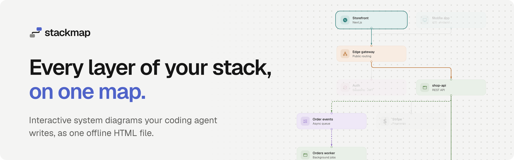
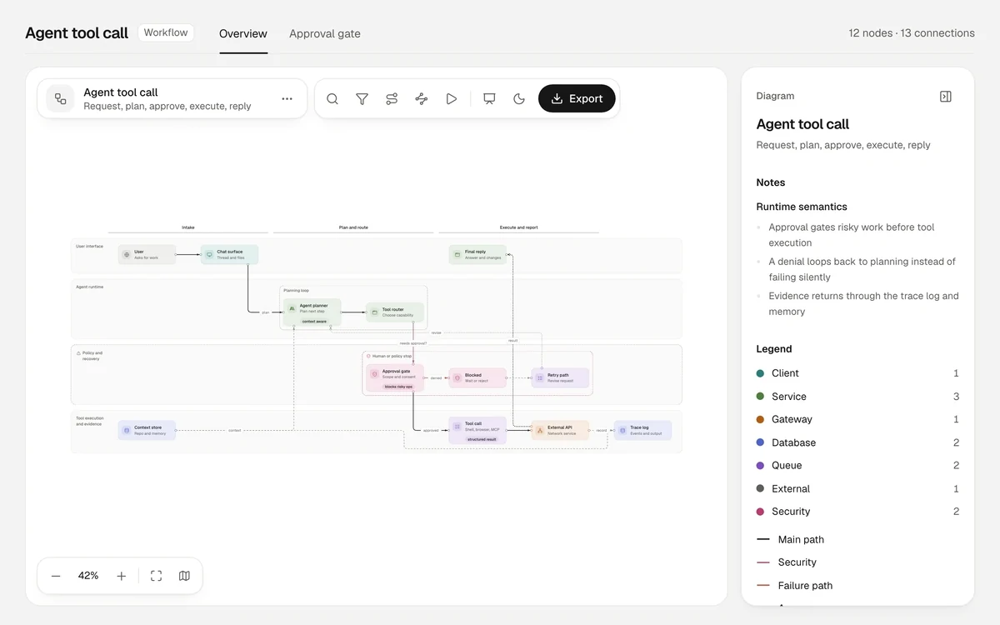
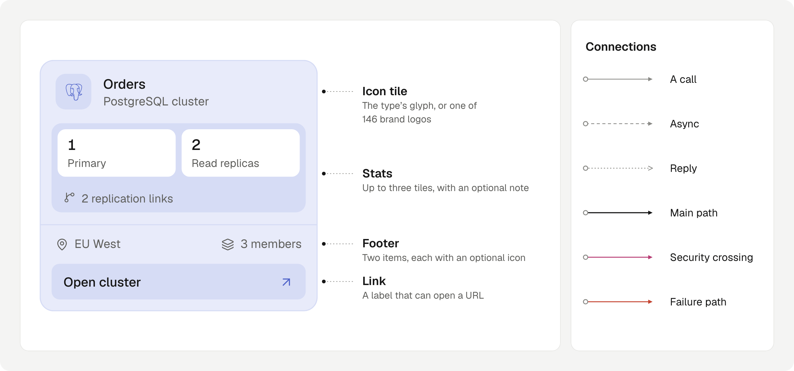

<p align="center">
  <picture>
    <source media="(prefers-color-scheme: dark)" srcset="assets/brand/stackmap-readme-header-dark.png">
    
  </picture>
</p>

<p align="center">
  <a href="https://www.npmjs.com/package/@omsimos/stackmap"></a>
  <a href="https://github.com/omsimos/stackmap/actions/workflows/ci.yml"></a>
  <a href="LICENSE"></a>
</p>

<p align="center">
  <a href="https://stackmap.omsimos.com">Website</a> · <a href="https://stackmap.omsimos.com/docs">Docs</a> · <a href="https://stackmap.omsimos.com/examples">Examples</a>
</p>

Ask your coding agent to diagram a codebase, a system, a process or a request. It writes a small typed JSON, stackmap validates it with repair hints the agent acts on, lays it out, and delivers one self-contained HTML viewer. No server, no account, nothing to install to open it.

Five kinds of diagram: **architecture** (components and what they call), **dataflow** (data moving through stages), **workflow** (steps across owner lanes), **lifecycle** (the states of one thing) and **sequence** (messages over time).

https://github.com/user-attachments/assets/4dd05dfc-fa5a-42e7-ad1a-6150aeb9ad9f

## Quick start

Install the skill into your agent (Claude Code, Cursor, Codex and [others](https://github.com/vercel-labs/skills)):

```bash
npx skills add omsimos/stackmap
```

Then ask:

> Make an architecture diagram of this repository, backed by evidence from the code.

<p align="center">
  <picture>
    <source media="(prefers-color-scheme: dark)" srcset="assets/readme/agent-loop-dark.svg">
    
  </picture>
</p>

The agent writes `.stackmap/<name>/diagram.json`, validates and repairs it, and delivers `.stackmap/<name>/diagram.html`, opening it in your browser. It opens in any browser later too. To change the diagram, ask again: the agent edits the JSON and delivers it again. The viewer itself is read-only.

## The viewer

<p align="center">
  <picture>
    <source media="(prefers-color-scheme: dark)" srcset="assets/readme/tour-dark.webp">
    
  </picture>
</p>

- **Explore:** select a card to light its connections and dim the rest, with its details and source evidence in the inspector. **Trace** keeps a node's upstream and downstream; **Route** lights every path between two nodes.
- **Find:** search titles, ids and types; the **lens** dims the node types you don't need.
- **Guided views:** tabs the agent defines, like "Checkout path", that focus one part of the diagram. **Present** steps through them full screen.
- **Flow:** **Play** sends pulses along whatever you're looking at: the whole diagram, a view, a trace or a route, hop by hop.
- **Share:** the URL keeps the view, selection, route and playback. Export PNG, JPEG, WebP, SVG, or a short video of the flow.
- **Keyboard:** `/` search, `R` route, `F` present, `P` play, `M` minimap, `Esc` clear; Tab and the arrow keys reach everything else.
- **Themes:** dark and light, and animations respect reduced motion.

## The diagram

```json
{
  "$schema": "https://unpkg.com/@omsimos/stackmap@0.4.0/dist/stackmap.schema.json",
  "kind": "architecture",
  "title": "Bookshop",
  "direction": "DOWN",
  "groups": [{ "id": "data", "label": "Data tier" }],
  "nodes": [
    { "id": "api", "type": "service", "card": { "title": "shop-api", "subtitle": "REST API" },
      "evidence": [{ "file": "services/api/src/server.ts", "line": 12 }] },
    { "id": "db", "type": "database", "group": "data", "card": { "title": "Orders DB", "subtitle": "PostgreSQL", "brand": "postgresql" } }
  ],
  "edges": [{ "id": "api-db", "from": "api", "to": "db" }],
  "views": [{ "id": "state", "label": "State", "nodes": ["db"] }]
}
```

<p align="center">
  <picture>
    <source media="(prefers-color-scheme: dark)" srcset="assets/readme/card-dark.png">
    
  </picture>
</p>

- **Nodes:** nine types set the colour (`client`, `gateway`, `service`, `database`, `cache`, `queue`, `storage`, `external`, `security`), and lifecycles have seven state types. Cards can add rows, stats, a footer, a link and one of 146 [Simple Icons](https://simpleicons.org) logos.
- **Edges** can be `async` or a `return`, with a `tone` for the main path, security crossings and failure paths.
- **No coordinates:** stackmap lays everything out, with [ELK](https://eclipse.dev/elk/) for architecture and dataflow and its own layout for lanes and sequences.

Full reference: [skill/references/schema.md](skill/references/schema.md), or the [schema reference](https://stackmap.omsimos.com/docs/schema) on the website. Modelling guidance: [authoring contract](skill/references/authoring-contract.md).

## The CLI

The skill runs the CLI for you, and it works on its own too (Node 22.12 or later):

```bash
npx @omsimos/stackmap validate diagram.json [--json]                # diagnostics with fixes; exit 1 on errors
npx @omsimos/stackmap deliver  diagram.json [-o out.html] [--open]  # validate → layout → one offline HTML file
npx @omsimos/stackmap serve    diagram.json [--port 4400]           # live viewer that reloads on every save
```

- **validate** lists every problem with a code, its evidence and the allowed fixes, including card text that won't fit. It exits `1` when the diagram has errors and `2` on usage, IO or internal errors.
- **deliver** is deterministic: the same JSON always gives the same file, byte for byte.
- **serve** binds `127.0.0.1` only, keeps the last good version on screen when a save is invalid, and keeps your camera and selection across reloads.

## Development

Bun workspaces monorepo; tests run on Node via Vitest and Playwright.

```bash
bun install
bun run test && bun run typecheck && bun run build   # unit tests, types, viewer template + CLI bundle
```

[CONTRIBUTING.md](CONTRIBUTING.md) covers the packages, the e2e and visual regression tests, branches, commit messages and how releases work. The mark, lockups, icons and social card are in [`assets/brand/`](assets/brand/), with the rules for using them.

## Credits

stackmap is a successor to [archify](https://github.com/tt-a1i/archify) by tt-a1i, itself based on [Cocoon AI's architecture-diagram-generator](https://github.com/Cocoon-AI/architecture-diagram-generator). It keeps archify's agent → JSON → validate → single-HTML model and its repair loop, with a new renderer and visual language. Layout by [Eclipse ELK](https://eclipse.dev/elk/) (elkjs, EPL-2.0), fonts [Geist](https://vercel.com/font) (OFL-1.1), logos [Simple Icons](https://simpleicons.org) (CC0).

## License

[MIT](LICENSE). Third-party components and their licenses: [THIRD_PARTY_NOTICES.md](THIRD_PARTY_NOTICES.md).
