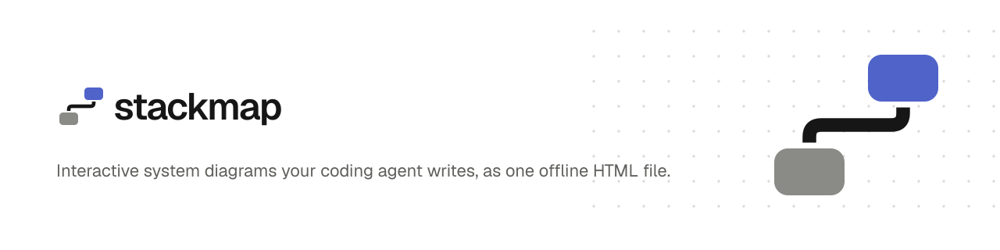
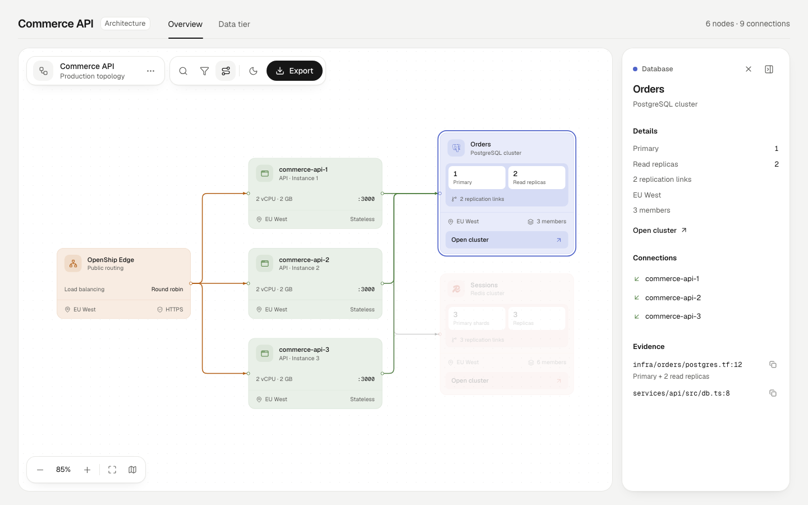
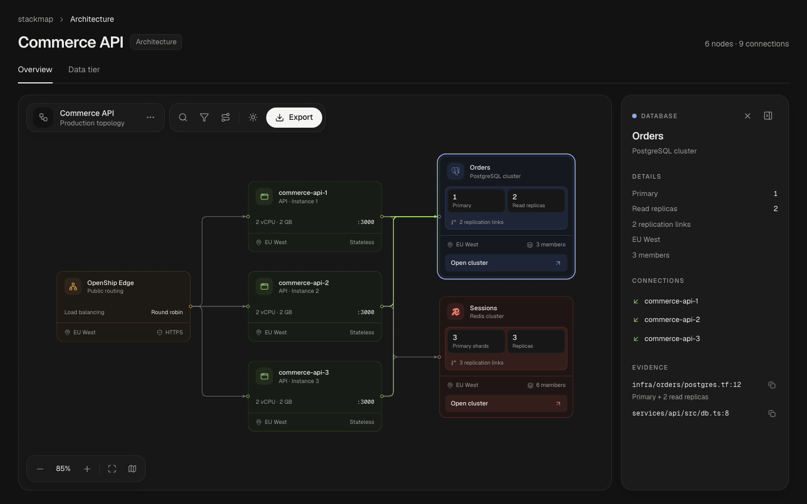

<picture>
  <source media="(prefers-color-scheme: dark)" srcset="assets/brand/stackmap-readme-header-dark.svg">
  
</picture>

You ask your agent to diagram a codebase, a system, a process or a request. It writes a small typed JSON, stackmap validates it with repair hints the agent acts on, lays it out, and hands you a single self-contained viewer — pan and zoom, search, trace, routes between two nodes, guided views, presentation mode, dark and light themes, image and video export. No server, no account, nothing to install to open it.

Five kinds of diagram: **architecture** (components and what they call), **dataflow** (data moving through stages), **workflow** (steps across owner lanes), **lifecycle** (the states of one thing) and **sequence** (messages over time).

<p align="center">
  
  
</p>

## Quick start

Install the skill into your agent (Claude Code, Cursor, Codex and [others](https://github.com/vercel-labs/skills)):

```bash
npx skills add hyamero/stackmap
```

Then ask:

> Make an architecture diagram of this repository, backed by evidence from the code.

The agent writes `.stackmap/<name>/diagram.json`, validates and repairs it, and delivers `.stackmap/<name>/diagram.html`. Open that file in any browser. To change the diagram, just ask again — the agent edits the JSON and re-delivers; the viewer itself is read-only.

## The CLI

The skill drives the CLI for you, but it works on its own too (Node ≥ 22.12):

```bash
npx @hyamero/stackmap validate diagram.json [--json]    # diagnostics with fixes; exit 1 on errors
npx @hyamero/stackmap deliver  diagram.json [-o out.html]  # validate → layout → one offline HTML file
npx @hyamero/stackmap serve    diagram.json [--port 4400]  # live viewer that reloads on every save
```

- **validate** reports every problem as `{ code, severity, subject, message, evidence, allowedFixes }` — schema errors, dangling references, group cycles, duplicate ids, orphans, and card text that wouldn't fit (measured with the real font). Exit codes: `0` ok, `1` the diagram has errors, `2` usage/IO/internal.
- **deliver** writes atomically and prints `delivered <path> · sha256 <hash> · <bytes> bytes`. The same input always gives byte-identical output.
- **serve** binds `127.0.0.1` only, keeps the last good version on screen when a save is invalid (the errors appear in a toast), and preserves the camera, selection and theme across reloads.

## The diagram

```json
{
  "$schema": "https://unpkg.com/@hyamero/stackmap@0.1.0/dist/stackmap.schema.json",
  "kind": "architecture",
  "title": "Bookshop",
  "direction": "DOWN",
  "groups": [{ "id": "data", "label": "Data tier" }],
  "nodes": [
    { "id": "api", "type": "service", "card": { "title": "shop-api", "subtitle": "REST API" },
      "evidence": [{ "file": "services/api/src/server.ts", "line": 12 }] },
    { "id": "db", "type": "database", "group": "data", "card": { "title": "Orders DB", "subtitle": "PostgreSQL", "brand": "postgresql" } }
  ],
  "edges": [{ "id": "api-db", "from": "api", "to": "db" }],
  "views": [{ "id": "state", "label": "State", "nodes": ["db"] }]
}
```

Nine node types set the colour (`client`, `gateway`, `service`, `database`, `cache`, `queue`, `storage`, `external`, `security`); lifecycles use seven state types (`start`, `active`, `waiting`, `decision`, `success`, `failure`, `neutral`). Cards can carry rows, stats, a footer and a link, or be compact (title, subtitle, tag); `brand` adds one of 146 [Simple Icons](https://simpleicons.org) logos. Edges can be `async` or a `return`, and a `tone` marks the main path, security crossings and failure paths. There are no coordinates: [ELK](https://eclipse.dev/elk/) lays out architecture and dataflow diagrams, and stackmap's own layout places swimlanes (workflow, lifecycle) and sequences, deriving columns, message rows and activation bars from the structure. Full reference: [skill/references/schema.md](skill/references/schema.md); modelling guidance: [authoring contract](skill/references/authoring-contract.md).

## The viewer

- **Explore:** click a card for its details, connections and source evidence (linked to your repo when `source.url` is set). **Trace** keeps a node's upstream and downstream and dims the rest. **Route** (`R`) picks two nodes and lights every directed path between them, listing the shortest.
- **Find:** `/` searches titles, subtitles, ids and types; the **lens** dims node types you don't care about.
- **Guided views:** tabs the agent defines (“Checkout path”, “Data tier”) that dim everything else and fit the camera. **Present** (`F`) goes full screen and steps through them with the arrow keys.
- **Flow:** **Play** (`P`) sends pulses along the connections, looping. It plays whatever you're looking at: the whole diagram as one wave in reading order (time order for a sequence), a view's connections, a selection's (its whole trace when tracing), or a route hop by hop from its start. It keeps playing while you present.
- **Radar:** the minimap (`M`) mirrors what's lit and dimmed, and drags the camera.
- **Share:** state lives in the URL hash (`#view=…&node=…&lens=…&route=…&play=1`); export PNG (1×/2×), copy PNG, JPEG, WebP, an SVG snapshot, or a short video of that flow (WebM, or MP4 where that's what the browser records).
- **Keyboard:** Tab reaches the toolbar, then the canvas; arrows move between cards, Enter selects (or picks a route end), Esc clears a selection or ends a route; `/`, `R`, `F`, `P` and `M` open search, route, presentation, flow playback and the radar; with the canvas focused, arrows pan and `+`/`-`/`0` zoom. Honours reduced motion.

## Development

Bun workspaces monorepo; tests run on Node via Vitest and Playwright.

```bash
bun install
bun run test && bun run typecheck && bun run build   # unit tests, types, viewer template + CLI bundle
cd packages/viewer && bunx playwright test            # viewer e2e (dev server)
cd packages/cli && bunx playwright test               # delivered-file + live-serve e2e
```

| Package | What it does |
|---|---|
| `packages/core` | types, theme tokens, card metrics, headless text measurement (generated Geist metrics), samples |
| `packages/schema` | Zod schema → `stackmap.schema.json`, the validator and its diagnostics |
| `packages/layout` | ELK wrapper: diagram → absolute node/group/edge geometry |
| `packages/viewer` | React viewer, built into one self-contained HTML template |
| `packages/cli` | `@hyamero/stackmap`: validate · deliver · serve |
| `skill/` | the agent skill that `npx skills add` installs |

The mark, lockups, icons and social card are in [`assets/brand/`](assets/brand/), with the rules for using them.

Visual regression baselines are Linux-only and are checked in CI. Regenerate them with the CI workflow's *update-visual* run (it uploads them as an artifact), or locally with `bun run --filter @stackmap/viewer visual:update` (Playwright's Linux image in Docker). `bun run --filter @stackmap/viewer metrics:gen` regenerates the font metrics after a font change.

## Credits

stackmap is a successor to [archify](https://github.com/tt-a1i/archify) by tt-a1i, itself based on [Cocoon AI's architecture-diagram-generator](https://github.com/Cocoon-AI/architecture-diagram-generator) — it keeps archify's agent → JSON → validate → single-HTML model and repair-loop contract, with a new renderer and visual language. Layout by [Eclipse ELK](https://eclipse.dev/elk/) (elkjs, EPL-2.0), fonts [Geist](https://vercel.com/font) (OFL-1.1), logos [Simple Icons](https://simpleicons.org) (CC0).

## License

[MIT](LICENSE). Third-party components and their licenses: [THIRD_PARTY_NOTICES.md](THIRD_PARTY_NOTICES.md).
